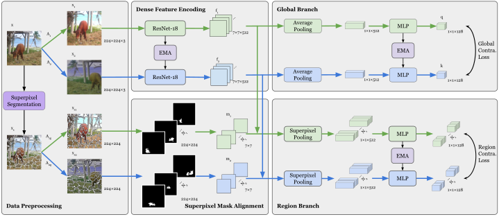
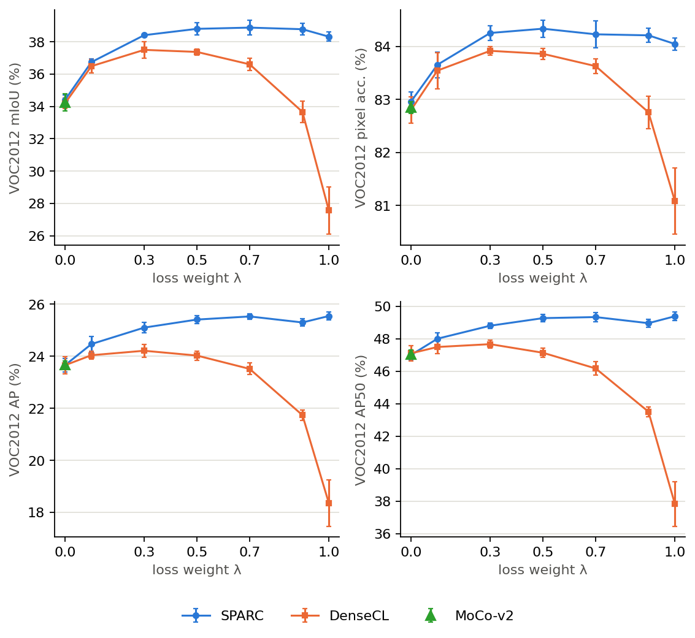
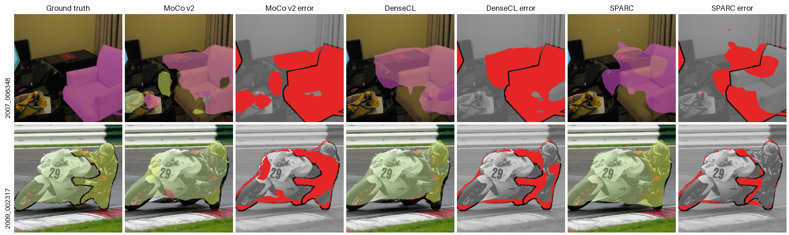
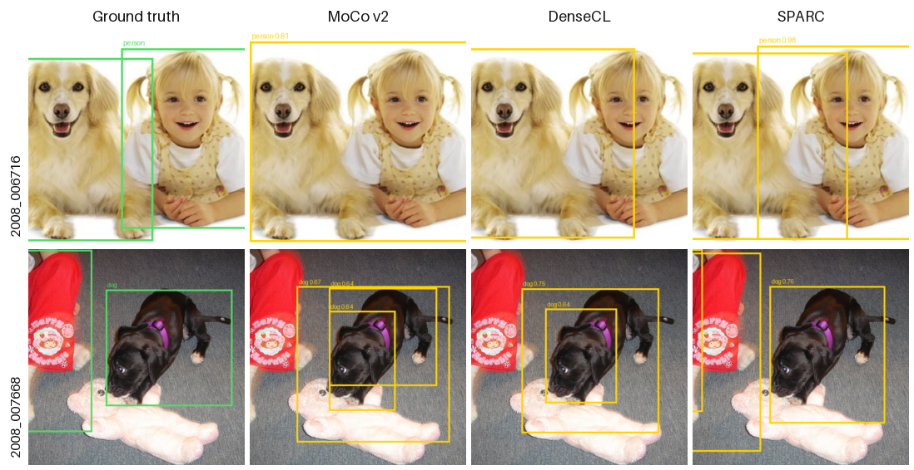

# SPARC

**SuperPixel-Aware Region Contrastive learning** for self-supervised dense prediction.

[](https://github.com/xRIPEIx/SPARC/actions/workflows/ci.yml)
[](LICENSE)

SPARC adds a **region-level** contrastive term to image-level self-supervised
learning, where the regions are superpixels. Superpixels are used only to pool
encoder features — never as an input channel — so a SPARC-pretrained backbone
transfers to downstream tasks with no mask dependency at all.

```
L = (1 − λ) · L_global + λ · L_region          λ = 0 recovers MoCo v2 exactly
```



## Results

<!-- results:start -->
VOC2012 transfer from COCO pretraining, ResNet-18, mean ± s.d. over 5 seeds, in percent.

| Initialisation | mIoU | pixel acc. | AP | AP50 | AP75 |
|---|---|---|---|---|---|
| Random init | 17.3 ± 0.1 | 75.9 ± 0.1 | 15.1 ± 0.2 | 32.9 ± 0.7 | 11.5 ± 0.2 |
| Supervised ImageNet | 50.3 ± 0.3 | 88.0 ± 0.1 | 34.0 ± 0.3 | 62.6 ± 0.3 | 33.0 ± 0.4 |
| MoCo v2 | 34.2 ± 0.5 | 82.9 ± 0.1 | 23.7 ± 0.1 | 47.1 ± 0.2 | 20.8 ± 0.3 |
| DenseCL | 37.4 ± 0.2 | 83.9 ± 0.1 | 24.0 ± 0.2 | 47.1 ± 0.3 | 21.7 ± 0.2 |
| **SPARC** (λ = 0.5) | **38.8 ± 0.4** | **84.3 ± 0.2** | **25.4 ± 0.2** | **49.3 ± 0.2** | **23.1 ± 0.3** |

**λ ablation.** Both objectives are `(1 − λ)·L_global + λ·L_local`; at λ = 0 each reduces to MoCo v2.

| λ | SPARC mIoU | DenseCL mIoU | SPARC AP | DenseCL AP |
|---|---|---|---|---|
| 0 | 34.4 ± 0.3 | 34.2 ± 0.3 | 23.7 ± 0.3 | 23.7 ± 0.3 |
| 0.1 | 36.7 ± 0.2 | 36.5 ± 0.4 | 24.5 ± 0.3 | 24.0 ± 0.2 |
| 0.3 | 38.4 ± 0.1 | 37.5 ± 0.5 | 25.1 ± 0.2 | 24.2 ± 0.2 |
| 0.5 | 38.8 ± 0.4 | 37.4 ± 0.2 | 25.4 ± 0.2 | 24.0 ± 0.2 |
| 0.7 | 38.9 ± 0.5 | 36.6 ± 0.4 | 25.5 ± 0.1 | 23.5 ± 0.2 |
| 0.9 | 38.8 ± 0.4 | 33.7 ± 0.7 | 25.3 ± 0.1 | 21.7 ± 0.2 |
| 1 | 38.3 ± 0.3 | 27.6 ± 1.5 | 25.5 ± 0.1 | 18.4 ± 0.9 |

Seed-to-seed s.d. on mIoU is ≈0.4 points, so differences below ≈0.8 points are not resolvable at this sample size.
<!-- results:end -->



Generated from [`experiments/results/aggregate/`](experiments/results/aggregate/)
by `sparc-report` — never typed by hand; CI fails if table and data drift apart.

**Qualitative comparison.** MoCo v2, DenseCL, and SPARC.

*Segmentation* — red marks pixels where the predicted class disagrees with ground truth; SPARC's error maps show visibly less red than either baseline's.



*Detection* — SPARC localizes objects that MoCo v2 and DenseCL miss or only partially detect at the same 0.6 confidence threshold.



## Where is…?

| I want to understand… | Go to |
|---|---|
| The region contrastive loss | [`losses/region_contrastive.py`](src/sparc/losses/region_contrastive.py) |
| Superpixel region pooling | [`models/region_pooling.py`](src/sparc/models/region_pooling.py) |
| How the pieces compose into a loss | [`methods/sparc.py`](src/sparc/methods/sparc.py) |
| The pretraining loop | [`engine/trainer.py`](src/sparc/engine/trainer.py) |
| Aligned image/mask augmentation | [`data/transforms.py`](src/sparc/data/transforms.py) |
| How superpixel masks are generated | [`data/superpixel/`](src/sparc/data/superpixel/) |
| Segmentation / detection fine-tuning | [`eval/segmentation.py`](src/sparc/eval/segmentation.py), [`eval/detection.py`](src/sparc/eval/detection.py) |
| How mIoU and AP are computed | [`eval/metrics.py`](src/sparc/eval/metrics.py) |
| Adding a backbone | [`models/backbones/`](src/sparc/models/backbones/) |
| **Where my datasets are** | [`configs/paths.yaml`](configs/paths.yaml) — the only file you must edit |
| The math, with shapes | [`docs/method.md`](docs/method.md) |

## Install

```bash
git clone https://github.com/xRIPEIx/SPARC.git && cd SPARC
pip install -e ".[dev]"
pytest                       # ~1 min, CPU only, no datasets — this is the install check
```

## Five minutes, no dataset

Run a released fine-tuned model on your own photos:

```bash
python scripts/download_checkpoints.py seg_head
python scripts/demo_predict.py --task segmentation \
    --weights checkpoints/sparc_lambda_0p5_voc_segmentation_resnet18.pth \
    --images path/to/any/jpegs --out demo_out
```

Then, in increasing cost — each step in [`docs/reproduce.md`](docs/reproduce.md)
states what it needs and what number to expect:

| | Needs | Cost | Gives you |
|---|---|---|---|
| Fine-tune a released encoder | VOC2012 (~2 GB) | ~2 GPU-h | the headline table |
| Pretrain one configuration | COCO (~19 GB) + one mask set | ~15 GPU-h | the pipeline end to end |
| The full study | same data | ~70 pretrains + 140 fine-tunes | every table and figure |

Released weights: [`MODEL_ZOO.md`](MODEL_ZOO.md).

## Configure

Dataset locations live in **one file**, [`configs/paths.yaml`](configs/paths.yaml).
Set them with environment variables, or copy `configs/paths.local.yaml.example`
to `configs/paths.local.yaml` (gitignored):

```bash
export SPARC_COCO_IMAGES=/data/coco/train2017
export SPARC_SUPERPIXEL_ROOT=/data/superpixel_masks
export SPARC_VOC_ROOT=/data/VOC                    # the directory containing VOCdevkit
```

Every other config refers to `${paths.*}`; nothing else needs editing. On a
single-GPU machine there is nothing to configure for hardware — `train.device`
defaults to `auto`. Multi-GPU boxes: `--set train.gpu=1`. Match
`data.num_workers` to your CPU cores. For a run of your own, write a config that
inherits from a shipped one and overrides only what differs — see
[`docs/configuration.md`](docs/configuration.md#your-own-run).

## Use

```bash
sparc-masks    --config configs/superpixel/slic_n100.yaml            # superpixels, once per image tree
sparc-pretrain --config configs/pretrain/sparc_coco_r18.yaml          # SPARC; moco_ / densecl_ for baselines
sparc-eval     --config configs/downstream/voc_seg_fcn_r18.yaml \
               --set model.ssl_ckpt=runs/checkpoints/sparc_lambda_0p5/last.pth
```

Change anything from the command line; unknown keys are rejected, not ignored:

```bash
sparc-pretrain --config configs/pretrain/sparc_coco_r18.yaml --set method.lambda_region=0.7 train.seed=3
```

## Swap the backbone

A different architecture is a config change, not a code change — for
pretraining **and** both downstream heads, which size themselves from the
backbone's reported channels:

```bash
sparc-pretrain --config configs/pretrain/sparc_coco_r18.yaml --set backbone.name=resnet50
sparc-pretrain --config configs/pretrain/sparc_coco_r18.yaml --set backbone.name=timm:convnext_tiny
```

Adding a backbone family, a dataset, a superpixel method or a pretraining
objective is one registry entry each: [`docs/extending.md`](docs/extending.md).

## Reproduce the tables

Every sweep is one YAML, expanded to a manifest that both the pretraining and
evaluation jobs read — so the value a checkpoint was trained with and the value
recorded against its result cannot disagree:

```bash
sparc-sweep expand configs/sweeps/sparc_lambda.yaml -o experiments/sparc_lambda/manifest.csv
bash slurm/submit_sweep.sh --sweep sparc_lambda --seed 1            # SLURM; optional
sparc-report aggregate --manifest experiments/sparc_lambda/manifest.csv \
                       --results-root runs/results --task segmentation \
                       -o experiments/results/aggregate/sparc_lambda_segmentation_by_config.csv
make paper                                                            # check, tables, figures
```

`sparc-report check` verifies that `sparc_lambda_0`, `densecl_lambda_0` and
MoCo v2 — three routes to the same objective — agree within seed noise, and that
no configuration is reported twice. CI runs it.

## Docs

[install](docs/install.md) · [datasets](docs/datasets.md) ·
[method](docs/method.md) · [configuration](docs/configuration.md) ·
[training](docs/training.md) · [evaluation](docs/evaluation.md) ·
[experiments](docs/experiments.md) · [cluster](docs/cluster.md) ·
[reproduce](docs/reproduce.md) · [extending](docs/extending.md) ·
[FAQ](docs/faq.md)

## What this repository does and does not contain

Code, configs, experiment manifests, and the **aggregated** results every table
and figure is rendered from (a few tens of KB).

**No datasets, no superpixel masks, no per-run outputs and no model weights.**
Masks are regenerated by `sparc-masks` — identically, from the pinned
scikit-image. Weights are GitHub Release assets. This keeps a clone small, and
CI enforces it.

## Citation

```bibtex
@software{sparc2026,
  author = {Szczecina, David and Xiang, Yuanpei and Hu, Jitao and Fieguth, Paul
            and Clausi, David and Chen, Yuhao and Deglint, Jason},
  title  = {{SPARC}: SuperPixel-Aware Region Contrastive Learning for Self-Supervised Dense Prediction},
  year   = {2026},
  url    = {https://github.com/xRIPEIx/SPARC},
  note   = {University of Waterloo, Systems Design Engineering. The first three authors contributed equally.}
}
```

See [`CITATION.cff`](CITATION.cff). MIT licensed — [LICENSE](LICENSE).
