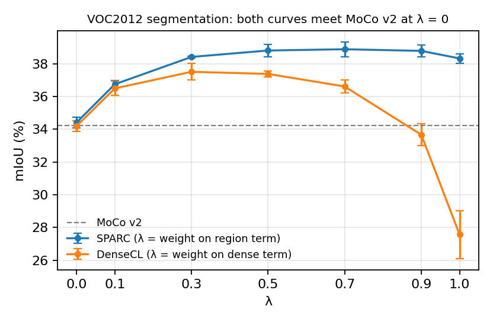

# SPARC

**S**uper**P**ixel-**A**ware **R**egion **C**ontrastive learning for self-supervised dense prediction.

> **Status: under construction.** The full pipeline works end to end —
> mask generation, pretraining, downstream evaluation, sweeps and reporting.
> The model zoo and the full `docs/` land next.

SPARC adds a region-level contrastive term to image-level self-supervised
learning. Superpixels define the regions, and are used to pool encoder features
*after* the backbone — they are never fed into the CNN as an extra input
channel, so a SPARC-pretrained backbone transfers with no mask dependency:

```
L = (1 - λ) · L_global + λ · L_region
```

At `λ = 0` this reduces exactly to the MoCo-global objective, which is what lets
the SPARC and DenseCL λ sweeps meet the MoCo v2 baseline at a single shared point.

## Results

<!-- results:start -->
VOC2012 transfer from COCO pretraining, ResNet-18, mean ± s.d. over 5 seeds, in percent.

| Initialisation | mIoU | pixel acc. | AP | AP50 | AP75 |
|---|---|---|---|---|---|
| Random init | 17.3 ± 0.1 | 75.9 ± 0.1 | 15.1 ± 0.2 | 32.9 ± 0.7 | 11.5 ± 0.2 |
| Supervised ImageNet | 50.3 ± 0.3 | 88.0 ± 0.1 | 34.0 ± 0.3 | 62.6 ± 0.3 | 33.0 ± 0.4 |
| MoCo v2 | 34.2 ± 0.5 | 82.9 ± 0.1 | 23.7 ± 0.1 | 47.1 ± 0.2 | 20.8 ± 0.3 |
| DenseCL | 37.4 ± 0.2 | 83.9 ± 0.1 | 24.0 ± 0.2 | 47.1 ± 0.3 | 21.7 ± 0.2 |
| **SPARC** (λ = 0.5) | **38.8 ± 0.4** | **84.3 ± 0.2** | **25.4 ± 0.2** | **49.3 ± 0.2** | **23.1 ± 0.3** |

**λ ablation.** Both objectives are `(1 − λ)·L_global + λ·L_local`; at λ = 0 each reduces to MoCo v2.

| λ | SPARC mIoU | DenseCL mIoU | SPARC AP | DenseCL AP |
|---|---|---|---|---|
| 0 | 34.4 ± 0.3 | 34.2 ± 0.3 | 23.7 ± 0.3 | 23.7 ± 0.3 |
| 0.1 | 36.7 ± 0.2 | 36.5 ± 0.4 | 24.5 ± 0.3 | 24.0 ± 0.2 |
| 0.3 | 38.4 ± 0.1 | 37.5 ± 0.5 | 25.1 ± 0.2 | 24.2 ± 0.2 |
| 0.5 | 38.8 ± 0.4 | 37.4 ± 0.2 | 25.4 ± 0.2 | 24.0 ± 0.2 |
| 0.7 | 38.9 ± 0.5 | 36.6 ± 0.4 | 25.5 ± 0.1 | 23.5 ± 0.2 |
| 0.9 | 38.8 ± 0.4 | 33.7 ± 0.7 | 25.3 ± 0.1 | 21.7 ± 0.2 |
| 1 | 38.3 ± 0.3 | 27.6 ± 1.5 | 25.5 ± 0.1 | 18.4 ± 0.9 |

Seed-to-seed s.d. on mIoU is ≈0.4 points, so differences below ≈0.8 points are not resolvable at this sample size.
<!-- results:end -->



The table and figure are generated from
[`experiments/results/aggregate/`](experiments/results/aggregate/) by
`sparc-report`, never typed by hand, and CI fails if they drift from the data.
Regenerate with `make paper`.

## Where is…?

| I want to understand… | Go to |
|---|---|
| The region contrastive loss | [`losses/region_contrastive.py`](src/sparc/losses/region_contrastive.py) |
| Superpixel region pooling | [`models/region_pooling.py`](src/sparc/models/region_pooling.py) |
| How the pieces compose into a loss | [`methods/sparc.py`](src/sparc/methods/sparc.py) |
| The pretraining loop | [`engine/trainer.py`](src/sparc/engine/trainer.py) |
| Aligned image/mask augmentation | [`data/transforms.py`](src/sparc/data/transforms.py) |
| Segmentation fine-tuning | [`eval/segmentation.py`](src/sparc/eval/segmentation.py) |
| Detection fine-tuning | [`eval/detection.py`](src/sparc/eval/detection.py) |
| How mIoU and AP are computed | [`eval/metrics.py`](src/sparc/eval/metrics.py) |
| How superpixel masks are generated | [`data/superpixel/`](src/sparc/data/superpixel/) |
| Adding a backbone | [`models/backbones/`](src/sparc/models/backbones/) |
| Checkpoint → downstream backbone | [`engine/checkpoint.py`](src/sparc/engine/checkpoint.py) |
| **Where my datasets are** | [`configs/paths.yaml`](configs/paths.yaml) — the only file you must edit |

## Install

```bash
pip install -e ".[dev]"
pytest                       # fast, CPU-only, no datasets needed
```

## Configure

Dataset locations live in exactly one place. Either set environment variables:

```bash
export SPARC_COCO_IMAGES=/path/to/coco/train2017
export SPARC_SUPERPIXEL_ROOT=/path/to/superpixel_masks
```

or copy `configs/paths.local.yaml.example` to `configs/paths.local.yaml` (which
is gitignored) and edit it. Every other config refers to `${paths.*}` and never
to a literal path.

## Generate superpixel masks

```bash
sparc-masks --config configs/superpixel/slic_n100.yaml            # the paper's setting
sparc-masks --config configs/superpixel/slic_n100.yaml --num-shards 32 --shard-index 7
```

One `.npy` per image, mirroring the image tree, plus a metadata file recording
how the set was made. Resumable, so a job that hits its time limit is re-run
rather than restarted. Masks regenerate **identically** from the pinned
`scikit-image` — verified against the original study's archive — and are stored
as `uint8`, a quarter the size of `int32` with the same values.

## Pretrain

```bash
sparc-pretrain --config configs/pretrain/sparc_coco_r18.yaml
```

Change anything from the command line; unknown keys are rejected rather than
silently ignored:

```bash
sparc-pretrain --config configs/pretrain/sparc_coco_r18.yaml \
               --set method.lambda_region=0.7 train.seed=3
```

Baselines need no superpixel masks:

```bash
sparc-pretrain --config configs/pretrain/moco_coco_r18.yaml
sparc-pretrain --config configs/pretrain/densecl_coco_r18.yaml
```

## Evaluate

Fine-tune a pretrained backbone on VOC and write a result row:

```bash
sparc-eval --config configs/downstream/voc_seg_fcn_r18.yaml \
           --set model.ssl_ckpt=runs/checkpoints/sparc_lambda_0p5/last.pth \
                 experiment.config_id=sparc_lambda_0p5

sparc-eval --config configs/downstream/voc_det_frcnn_r18.yaml \
           --set model.ssl_ckpt=runs/checkpoints/sparc_lambda_0p5/last.pth \
                 experiment.config_id=sparc_lambda_0p5
```

Baselines need no checkpoint — `--set model.init=random` or
`model.init=supervised_imagenet`.

Both tasks share one frozen protocol (learning rate, weight decay, schedule),
tuned once and then applied to every arm, so the comparison measures the
pretraining objective rather than how much hyper-parameter search each arm got.

Loading a checkpoint that does not fit the requested architecture is a hard
error, not a warning: a partial load would leave most of the network randomly
initialised and still report a perfectly plausible metric.

## Swap the backbone

A different architecture is a config change, not a code change:

```bash
sparc-pretrain --config configs/pretrain/sparc_coco_r18.yaml --set backbone.name=resnet50
sparc-pretrain --config configs/pretrain/sparc_coco_r18.yaml --set backbone.name=timm:convnext_tiny
```

The same override works for `sparc-eval`. Built in: `resnet18/34/50/101/152`.
Any [timm](https://github.com/huggingface/pytorch-image-models) model works via
the `timm:` prefix (`pip install 'sparc-ssl[timm]'`). Adding a new family means
writing one registry entry — the FCN and Faster R-CNN heads size themselves from
the per-stage channel counts it reports, so neither needs to know the
architecture.

## Reproduce the tables

Every sweep is one YAML file, expanded to a manifest that both the pretraining
and the evaluation jobs read — so the value a checkpoint was trained with and
the value recorded against its result cannot disagree:

```bash
sparc-sweep expand configs/sweeps/sparc_lambda.yaml -o experiments/sparc_lambda/manifest.csv
bash slurm/submit_sweep.sh --sweep sparc_lambda --seed 1          # SLURM; see slurm/README.md
sparc-sweep status experiments/sparc_lambda/manifest.csv --results-root runs/results
sparc-report aggregate --manifest experiments/sparc_lambda/manifest.csv \
                       --results-root runs/results --task segmentation \
                       -o experiments/results/aggregate/sparc_lambda_segmentation_by_config.csv
make paper                                                          # tables, figures, README block
```

`sparc-report check` verifies that `sparc_lambda_0`, `densecl_lambda_0` and
MoCo v2 — three routes to the same objective — agree within seed noise, and
that no configuration is reported twice under two names. CI runs it.

## What this repository does and does not contain

Code, configs, experiment manifests, and the **aggregated** results
(mean ± s.d. per configuration, a few tens of KB) that every table and figure
is rendered from.

**No datasets, no superpixel masks, no per-run outputs and no model weights.**
Masks are generated by `sparc-masks`; pretrained weights are published as
GitHub Release assets. This keeps a clone small, and is enforced by CI rather
than only by `.gitignore`.

## License

MIT — see [LICENSE](LICENSE).
